# Image-Classi-cation-via-Neural-Network
Turkish Lira Banknote Dataset

**Code Description:**

**Because we have a large number of images and it is impossible to read their
information and cannot place them in Ram memory ,i used a technique
called Image Data Generator ,where images are in the system file, and each
time the network needs a set of data (Batch size) , the same number of
images are read randomly from the disk and are stored in memory. With
this technique, the neural network can be taught on thousands of images,
However, it is not possible to upload these images in Ram memory at once.In order to use the
image data generator technique, I considered a file to transfer and re-
size images, the name of this file is preprocess-dataset.ipynb.In fact, the
preprocess-dataset.ipynb file is responsible for transferring and resizing
images. In addition, another file is responsible for training,called neural-
net.ipynb. First, i'm going to explain about first file.**

**Preprocess-dataset.ipynb File**

**Cell 1:**

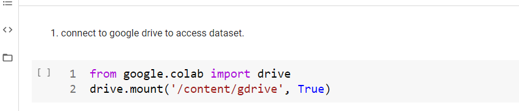
  
 **In this cell are the codes that related to the colab connection.**
 
 **Cell 2:**
 
 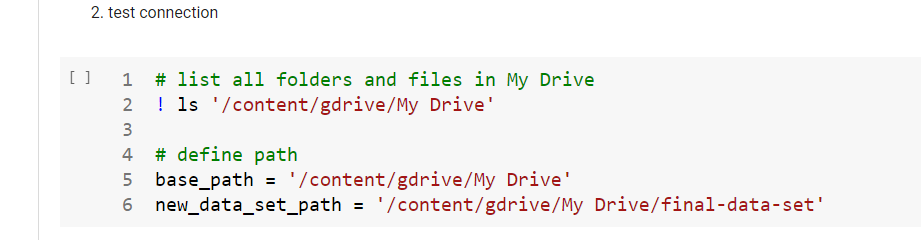
 
 **In this cell, two variable are defined in which the paths are stored,the base-
path is the default path and new-dataset-path is the folder address where
the new data is to be created.**
 
 **Cell 3:**
 
 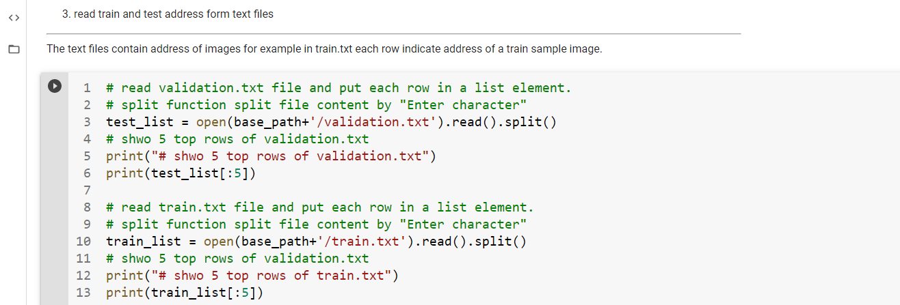
 
 **Inside the main dataset folder , there are two text files: Validation.txt
and train.txt.In each row of these two files ,there are a lot of images ad-
dresses.These addresses are samples related to train or test.**

**Cell 4:**
 
 
 
 **In this cell,a function is defined that takes five numbers from the first part
of image the image to determine what the category is.**

**Cell 5:**
 
 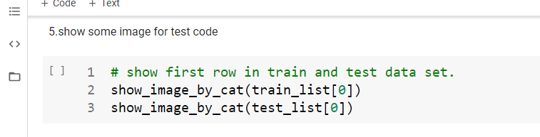
 
 **In this cell,two images are displayed as a test from two sets of test and train.**
 
 **Cell 6:**
 
 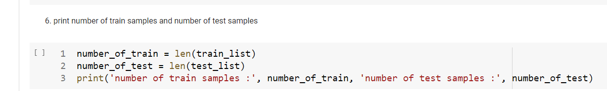
 
 **The images are read and print the number of training samples and number of test
samples.**

**Cell 7:**
 
 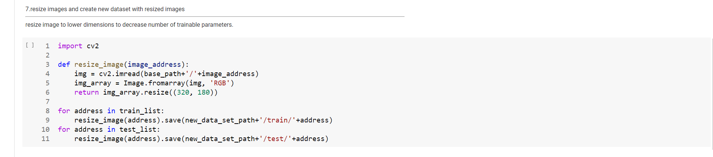
 
 **In this cell,From the main dataset that has six separate folder,the image are
read and resized.In fact,in this cell ,we can resize images to lower dimension
to decrease number of train parameters.**

**Neural-net.ipynb File:**

**Cell 1:**

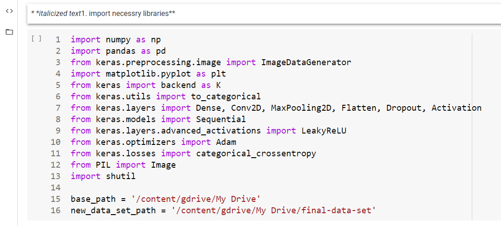

**First of all,we need a number of libraries to import during the project ,which
we enter in this cell,there are two important variables at the end of this
cell,the first address is the base path and the second address is the new
dataset path we created.**

**Cell 2:**

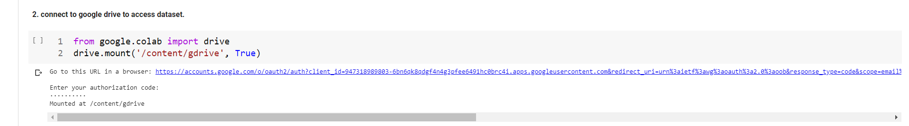

**In this cell,there is two lines of code that can be connected to google drive
with these two lines,for example,information can be read from google drive
and so on.**

**Cell 3:**

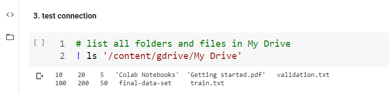

**In this cell ,a line of code is written , in which it is specified whether it
is properly connected to google drive or not.**

**Cell 4:**

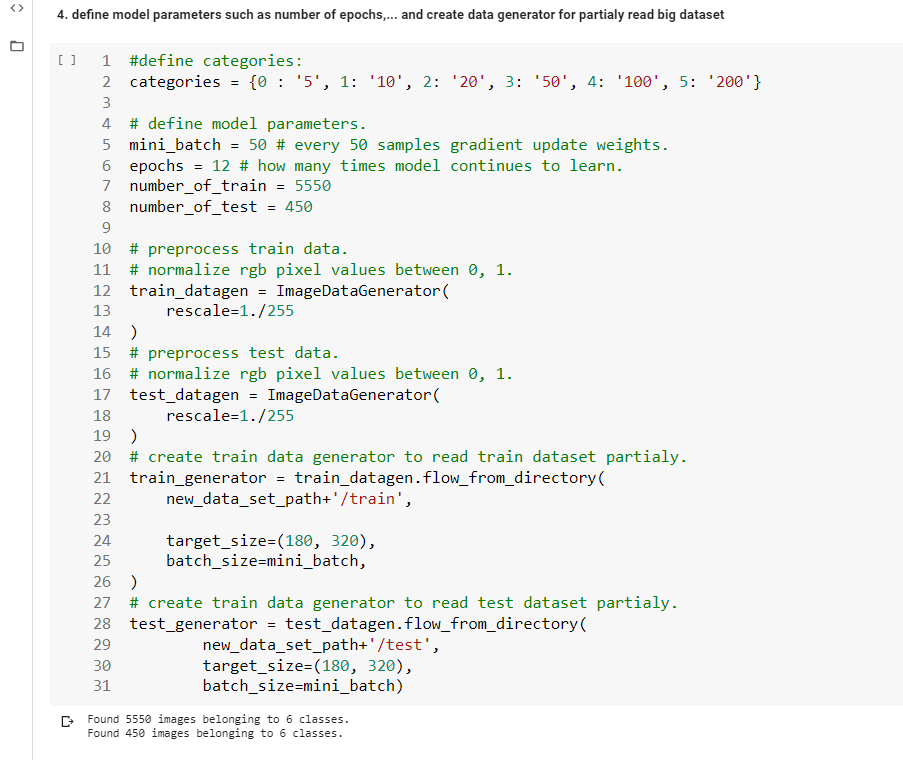

**In this cell,a number of parameters are defined for the neural network,such
as the number of batch ,number of epoch train samples ,number of test
samples.After this step ,we use the image data generator technique ,which
allows us to capture a large volume of images use inside the neural network.**

**Cell 5:**

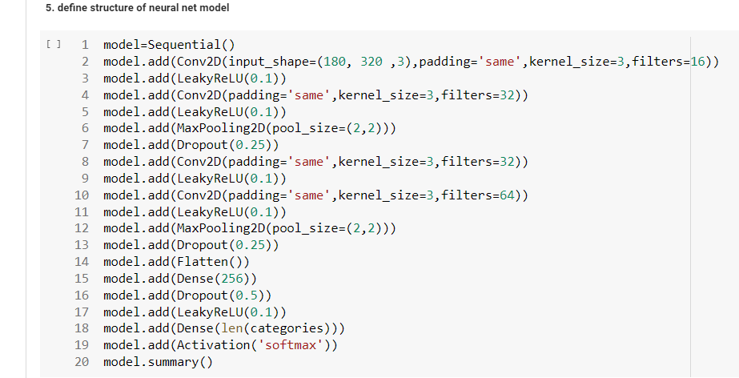

**In the fifth cell, we dene the neural network .In fact the neural network is
made up a series of layers such as Convolution layer,Leaky-Relu,Maxpooling,Dropout
and so on.**

**Cell 6:**

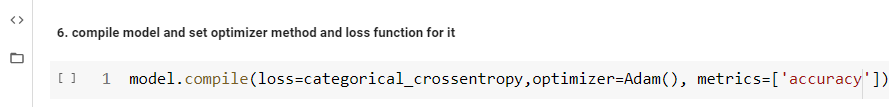

**This cell compiles our model ,and then we have to determine the type of
optimizer ,such as gradient descent,rmsprop,....,but the most famous opti-
mizer is called Adam ,which is both fast and optimal.**

**Cell 7:**

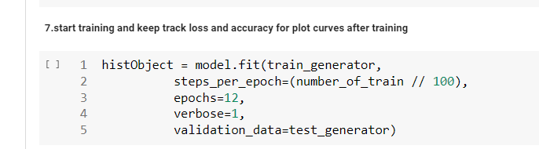

**In this cell is defined an object ,called hisObject.this object keeps a history
of accuracy and error at every step that we can use in the charts to show
the accuracy and error process.In addition,another object is dened , called
epoch,this object train our model twelve rounds,the number of rounds can
be changed.**

**Cell 8:**

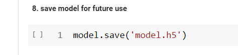

**This cell is to store our model,which is to store the structure and weights
in a file.In fact in neural network,we train to save our model so that if new
images come later ,it can predict what images will be in which classes.**

**Cell 9:**

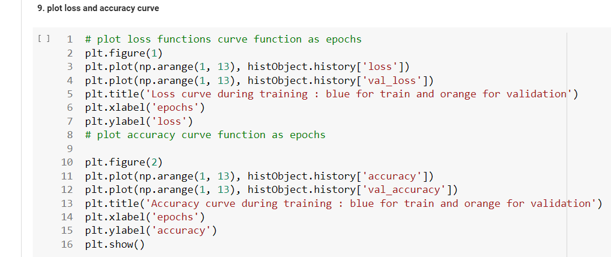

**In this cell,the trend of loss and accuracy shows us that the orange lines are
for the test and blue lines are for training.**
